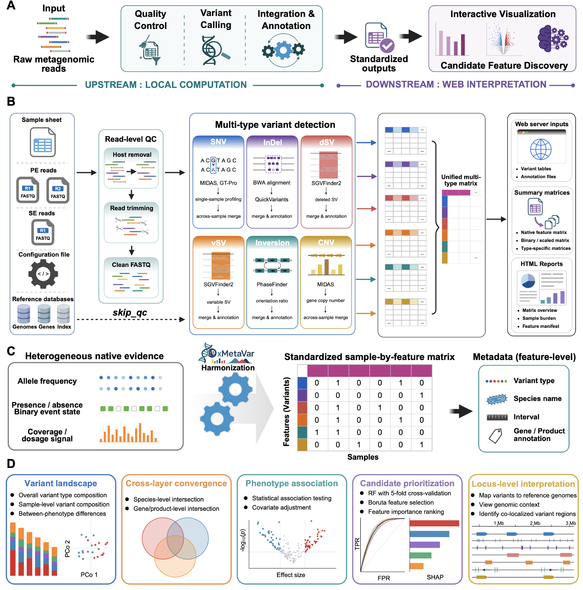

<div align="center">


### Scalable harmonization and interpretation of multi-layer microbial genomic variation across metagenomic cohorts

[](https://github.com/ldearlistm/xMetaVar/pkgs/container/xmetavar)
[](https://github.com/ldearlistm/xMetaVar/pkgs/container/xmetavar-frontend)
[](https://www.biosino.org/iMAC/xmetavar)
[](./LICENSE)
[](https://doi.org/10.6084/m9.figshare.30846347)

</div>

---

xMetaVar is a **metagenome-specific, reference-aware framework** for profiling and harmonizing single-nucleotide variants (SNVs), predefined SNP genotypes, short insertions/deletions (InDels), structural-variation-related signals (dSV/vSV), inversions, and gene-level copy-number variations (CNVs) into **standardized, locus-traceable cohort matrices**, while preserving variant-specific representations.

xMetaVar adopts a **two-stage local–web design** that separates computationally intensive read-level variant calling from reusable, interactive matrix-level interpretation:

- **Local workflow (this repository):** a containerized [Snakemake](https://snakemake.github.io/) pipeline that turns raw or host-depleted metagenomic reads into harmonized sample-by-feature matrices.
- **Web interpretation layer:** an interactive platform for cohort-level analysis and locus-level genomic inspection — available as a public web server or deployable as a self-hosted frontend.

> **Raw sequencing reads never leave your machine.** Only the compact standardized matrices, feature annotations and sample metadata are uploaded to the web layer, so read-level calling is performed once while downstream analyses can be repeated freely.

---

## Table of Contents

- [Part I — Local variant-calling workflow](#part-i--local-variant-calling-workflow)
  - [1. Installation](#1-installation)
    - [1.1 Hardware requirements](#11-hardware-requirements)
    - [1.2 Install Docker](#12-install-docker)
    - [1.3 Pull the backend image](#13-pull-the-backend-image)
    - [1.4 Obtain the reference database](#14-obtain-the-reference-database)
    - [1.5 Quick test with bundled example data](#15-quick-test-with-bundled-example-data)
  - [2. Prepare input data](#2-prepare-input-data)
    - [2.1 Project layout](#21-project-layout)
    - [2.2 The sample sheet (`samples.tsv`)](#22-the-sample-sheet-samplestsv)
    - [2.3 The configuration file (`config.yaml`)](#23-the-configuration-file-configyaml)
  - [3. Run the workflow](#3-run-the-workflow)
    - [3.1 Mount mapping](#31-mount-mapping)
    - [3.2 Run everything (`all`)](#32-run-everything-all)
    - [3.3 Modular target keys](#33-modular-target-keys)
    - [3.4 Cores and extra Snakemake arguments](#34-cores-and-extra-snakemake-arguments)
    - [3.5 HPC / Slurm](#35-hpc--slurm)
  - [4. Output files](#4-output-files)
  - [5. Usage tips \& troubleshooting](#5-usage-tips--troubleshooting)
- [Part II — Web-based interpretation](#part-ii--web-based-interpretation)
    - [Step-by-step website usage](#step-by-step-website-usage)
- [Part III — Self-host the web frontend](#part-iii--self-host-the-web-frontend)
    - [Prerequisites](#prerequisites)
    - [Start the frontend](#start-the-frontend)
  - [Reference database](#reference-database)
    - [Custom reference panel](#custom-reference-panel)
  - [Citation](#citation)
  - [License](#license)
  - [Contact](#contact)

---

## Features

- **Multi-layer variant profiling in one run** — integrates five complementary callers behind a unified reference framework:

  | Variant layer | Caller | Representation |
  | :-- | :-- | :-- |
  | SNVs (de novo) | MIDAS v3 | Minor-allele-frequency matrix — **default SNV layer** |
  | Predefined SNP genotypes *(optional)* | GT-Pro | Reference/alternative allele counts over a predefined SNP catalog (catalog downloaded separately) |
  | Short InDels | QuickVariants (BWA-MEM) | Binary presence/absence matrix |
  | dSV / vSV signals | SGVFinder2 (ICRA) | Deletion states / variable-segment scores |
  | Inversions | PhaseFinder | Orientation states |
  | Gene-level CNVs | MIDAS gene module | Normalized gene copy number |

> **A note on the two SNP layers.** De novo SNV profiling is performed by **MIDAS by default** and covers the standard SNV analysis needs. **GT-Pro** is offered as an *optional, complementary* layer for users who specifically want genotyping against its predefined SNP catalog. Because that catalog is large and distributed under its own release channel, it is **not bundled** in the xMetaVar reference database; to run the `snp_gtpro` target, download the GT-Pro database following its [official guide](https://github.com/zjshi/gt-pro) and set `GT_Pro_db`/`GT_dict_path` in `config.yaml`. If you do not need predefined-catalog genotyping, the MIDAS SNV output is sufficient and no extra download is required.

- **Harmonized, type-aware outputs** — native matrices preserve module-specific evidence; standardized matrices use variant-class-specific encoding for integrated cohort analysis.
- **Locus traceability** — every feature keeps its variant class, species, reference coordinate/interval, and gene/product annotation, so a cohort-level hit can always be traced back to its genomic context.
- **Reliability-aware** — simulation benchmarking defines variant-class-specific reliability boundaries by sequencing depth and community complexity.
- **Modular execution** — run the full pipeline or any combination of variant layers; regenerate deliverables from existing results without re-calling.
- **Reproducible by default** — one Docker image, fixed Conda environments, retained logs and QC summaries.



---

## Which way should I use xMetaVar?

| You want to… | Use this | Setup needed |
| :-- | :-- | :-- |
| Try analysis & visualization with **no installation** | [Public web server](https://www.biosino.org/iMAC/xmetavar) (use bundled demo data) | None |
| Call variants from **your own FASTQ reads** on a server/HPC | [Part I: local Docker workflow](#part-i--local-variant-calling-workflow) | Backend image + database |
| Explore the matrices you produced locally | Upload them to the [public web server](https://www.biosino.org/iMAC/xmetavar) | None |
| Host your **own private instance** of the web interface | [Part III: self-hosted frontend](#part-iii--self-host-the-web-frontend) | Frontend image + `public/` |

---

# Part I — Local variant-calling workflow

## 1. Installation

### 1.1 Hardware requirements

The workflow runs on Linux (or any host with a Docker engine). Recommended resources:

| Resource | Minimum | Recommended |
| :-- | :-- | :-- |
| CPU cores | 8 (allocate in multiples of 8) | 16–32; more cores process more samples/species in parallel, but also raise the concurrent memory demand |
| RAM | 16 GB | 64 GB+ for large cohorts / many parallel species |

Benchmark reference, measured on a Linux Slurm server across nested sample subsets:

| Cores | Samples | Input size (GB) | Read pairs (M) | Total time (h) | Avg CPU used (cores) | Avg mem (GB) | Peak mem (GB) |
| :-- | :-- | :-- | :-- | :-- | :-- | :-- | :-- |
| 8  | 4 | 8.59  | 62.66  | 13.86 | 2.56  | 3.45  | 22.41 |
| 16 | 2 | 4.32  | 31.63  | 3.01  | 5.46  | 4.14  | 22.93 |
| 16 | 4 | 8.59  | 62.66  | 6.16  | 5.52  | 9.00  | 43.10 |
| 16 | 8 | 17.61 | 128.11 | 12.53 | 5.50  | 8.69  | 38.24 |
| 32 | 4 | 8.59  | 62.66  | 2.95  | 11.54 | 31.16 | 52.32 |

### 1.2 Install Docker

Install the Docker Engine. No Conda, Snakemake or bioinformatics tool needs to be installed on the host — everything is inside the image.

### 1.3 Pull the backend image

```bash
docker pull ghcr.io/ldearlistm/xmetavar:1.0.1
```

The image bundles Snakemake v8.25.3 and all module Conda environments. Verify it runs:

```bash
docker run --rm ghcr.io/ldearlistm/xmetavar:1.0.1 --help
```

### 1.4 Obtain the reference database

Download the pre-compiled xMetaVar reference database from Figshare and unpack it:

- **Download:** [Database for xMetaVar — Figshare](https://doi.org/10.6084/m9.figshare.30846347) (4.60 GB, `xMetaVar_database.tar.xz`)
- **Unpack:**

  ```bash
  tar -xvf xMetaVar_database.tar.xz
  ```

- Mount the unpacked `database/` directory as described in [Section 3.1](#31-mount-mapping). This database is required **only for the local variant-calling workflow (Part I)** — neither the public web server nor a self-hosted web frontend needs it. See [Reference database](#reference-database) for panel details and custom references.

### 1.5 Quick test with bundled example data

A minimal paired-end example (sample sheets, `config.yaml` and demo FASTQs) is provided under [`test/`](./test): `test/example_pe_samples.tsv`, `test/example_se_samples.tsv`, `test/config.yaml`, and `test/rawdata/`.

Adapt the host paths below to your own project layout (the in-container paths after each `:` must stay unchanged). Dry-run first with the trailing `-n`, then remove it to execute.

Step 1 — run the selected variant modules (MIDAS SNV + InDel + all SV layers; the optional GT-Pro layer is omitted):

```bash
docker run --rm \
  -v "/path/to/project/config.yaml:/pipeline/config.yaml" \
  -v "/path/to/project/sample-pe.tsv:/pipeline/samples.tsv" \
  -v "/path/to/project/results:/pipeline/results" \
  -v "/path/to/project/rawdata:/pipeline/rawdata" \
  -v "/path/to/database:/pipeline/database" \
  -e XMETAVAR_CORES=16 \
  -e XMETAVAR_CHOWN_TO="$(id -u):$(id -g)" \
  ghcr.io/ldearlistm/xmetavar:1.0.1 snp_midas indel sv_sgvfinder sv_inversion sv_midas \
  -- --printshellcmds --rerun-incomplete --keep-going -n
```

Step 2 — assemble web-ready deliverables from the results:

```bash
docker run --rm \
  -v "/path/to/project/config.yaml:/pipeline/config.yaml" \
  -v "/path/to/project/sample-pe.tsv:/pipeline/samples.tsv" \
  -v "/path/to/project/results:/pipeline/results" \
  -v "/path/to/project/rawdata:/pipeline/rawdata" \
  -v "/path/to/database:/pipeline/database" \
  -e XMETAVAR_CORES=16 \
  -e XMETAVAR_CHOWN_TO="$(id -u):$(id -g)" \
  ghcr.io/ldearlistm/xmetavar:1.0.1 deliverables \
  -- --printshellcmds --rerun-incomplete --keep-going -n
```

> Drop the trailing `-n` to actually execute. Both steps use the same five mounts.

---

## 2. Prepare input data

### 2.1 Project layout

Organize a working directory on the host:

```text
my_project/
├── rawdata/          # input .fastq / .fastq.gz (PE or SE), gzip or uncompressed
├── database/         # unpacked xMetaVar reference database (see 1.4)
├── results/          # output directory (created automatically)
├── samples.tsv       # sample sheet (see 2.2)
└── config.yaml       # pipeline configuration (see 2.3)
```

### 2.2 The sample sheet (`samples.tsv`)

A **tab-separated** file. Paths inside the sheet use **in-container** paths (`/pipeline/rawdata/...`), because the sheet is read inside the container.

**Paired-end (PE)** — columns `sample`, `r1`, `r2`:

```tsv
sample	r1	r2
CCMD19168690ST-11-0	/pipeline/rawdata/CCMD19168690ST-11-0_1.fastq.gz	/pipeline/rawdata/CCMD19168690ST-11-0_2.fastq.gz
CCMD46727384ST-11-0	/pipeline/rawdata/CCMD46727384ST-11-0_1.fastq.gz	/pipeline/rawdata/CCMD46727384ST-11-0_2.fastq.gz
```

**Single-end (SE)** — columns `sample`, `se`:

```tsv
sample	se
SampleA	/pipeline/rawdata/SampleA.fastq.gz
```

> One row per sample. Match `sequencing_type` in `config.yaml` to the sheet layout (`PE` or `SE`).

### 2.3 The configuration file (`config.yaml`)

A ready-to-use template is provided at [`test/config.yaml`](./test/config.yaml). **It works out of the box and normally needs no editing** — just make sure the database paths match where you mounted `database/`. For your own data, the two fields you typically adjust are `sequencing_type` (`"PE"` or `"SE"`, to match the sample sheet) and `skip_qc` (set `true` only when supplying already host-depleted reads). Key fields:

| Field | Meaning |
| :-- | :-- |
| `raw_data_dir` | In-container input dir (`/pipeline/rawdata/`) |
| `results_dir` | In-container output dir (`/pipeline/results`) |
| `kneaddata_db` / `contaminant_db_prefix` | Host-depletion reference (e.g. `hg_38`); host build GRCh38 or T2T-CHM13 |
| `trimmomatic_path` | Trimmomatic adapters/tools path |
| `midasv3_db` | MIDAS v3 local database |
| `GT_Pro_db` / `GT_dict_path` | GT-Pro catalog and SNP dictionary *(optional layer; download the catalog separately per the note above)* |
| `QuickVariant_db` | Merged reference FASTA for BWA/QuickVariants |
| `SGVFinder2_db` | SGVFinder2 reference |
| `PhaseFinder_db` | PhaseFinder invertible-region reference |
| `annotation_file` | `43_species_features.tsv` feature annotation table |
| `samples_tsv` | In-container path to the sample sheet |
| `sequencing_type` | `"PE"` or `"SE"` |
| `skip_qc` | `true` to bypass KneadData when reads are already host-depleted |

Read preprocessing defaults (KneadData v0.12.0): Trimmomatic sliding-window `SLIDINGWINDOW:4:20`, `LEADING:3`, `TRAILING:3`, discard reads < 50 bp; host reads removed by Bowtie 2 alignment; tandem-repeat filtering bypassed. Set `skip_qc: true` only when supplying pre-cleaned, host-depleted reads.

---

## 3. Run the workflow

### 3.1 Mount mapping

Host directories are mounted to fixed in-container paths:

| Host path | Container path | Mode | Purpose |
| :-- | :-- | :-- | :-- |
| `./rawdata` | `/pipeline/rawdata` | `ro` | Input reads |
| `./results` | `/pipeline/results` | `rw` | All outputs |
| `./database` | `/pipeline/database` | `rw` | Reference database |
| `./config.yaml` | `/pipeline/config.yaml` | `ro` | Configuration |
| `./samples.tsv` | `/pipeline/samples.tsv` | `ro` | Sample sheet |

### 3.2 Run everything (`all`)

```bash
docker run --rm \
  -v "$(pwd)/rawdata:/pipeline/rawdata:ro" \
  -v "$(pwd)/results:/pipeline/results:rw" \
  -v "$(pwd)/database:/pipeline/database:rw" \
  -v "$(pwd)/config.yaml:/pipeline/config.yaml:ro" \
  -v "$(pwd)/samples.tsv:/pipeline/samples.tsv:ro" \
  -e XMETAVAR_CORES=16 \
  -e XMETAVAR_CHOWN_TO="$(id -u):$(id -g)" \
  ghcr.io/ldearlistm/xmetavar:1.0.1 all
```

`all` runs the complete workflow and then prepares the full deliverable set, with MIDAS as the default SNV layer. The complementary GT-Pro layer is optional and only runs if you have downloaded its separate catalog (see the Features note); most users can simply omit `snp_gtpro`.

### 3.3 Modular target keys

Replace `all` with one or more target keys to run only selected layers:

| Target key | Produces |
| :-- | :-- |
| `snp_gtpro` | GT-Pro predefined SNP table *(optional; requires the separately downloaded GT-Pro catalog — see Features note)* |
| `snp_midas` | MIDAS SNV outputs + done-flag |
| `indel` | QuickVariants InDel annotation matrix |
| `sv_sgvfinder` | SGVFinder2 dSV **and** vSV annotations |
| `sv_inversion` | PhaseFinder inversion annotation |
| `sv_midas` | MIDAS gene CNV output + done-flag |
| `deliverables` | Re-build web-ready files, summaries and HTML report **from existing results** (allows missing variant types) |
| `all` | Full workflow + full deliverables (default when no key is given) |

Example — run only InDel + SV layers on 8 cores:

```bash
docker run --rm [mounts...] -e XMETAVAR_CORES=8 \
  ghcr.io/ldearlistm/xmetavar:1.0.1 indel sv_sgvfinder sv_inversion sv_midas
```

> `all` cannot be combined with specific keys. Keys may be combined freely with each other.

### 3.4 Cores and extra Snakemake arguments

- Control parallelism with the `XMETAVAR_CORES` environment variable (default 16; choose a multiple of 8). **Do not pass `--cores`/`-c`/`--jobs`/`-j` directly** — the wrapper manages these and rejects them.
- Pass any additional Snakemake arguments after a `--` separator, for example:

  ```bash
  docker run --rm [mounts...] -e XMETAVAR_CORES=16 \
    ghcr.io/ldearlistm/xmetavar:1.0.1 all -- --printshellcmds --rerun-incomplete --keep-going
  ```

- On shared systems, add `-e XMETAVAR_CHOWN_TO="$(id -u):$(id -g)"` so result files remain owned by your host user.

### 3.5 HPC / Slurm

Wrap the `docker run` command in a batch script (template: [`test/example_pipeline.job`](./test/example_pipeline.job)). A common pattern is to (1) run the chosen variant modules, then (2) run `deliverables` to assemble web-ready outputs:

```bash
# step 1: variant modules
docker run --rm [mounts...] -e XMETAVAR_CORES=16 -e XMETAVAR_CHOWN_TO="$(id -u):$(id -g)" \
  ghcr.io/ldearlistm/xmetavar:1.0.1 snp_midas indel sv_sgvfinder sv_inversion sv_midas \
  -- --printshellcmds --rerun-incomplete --keep-going

# step 2: assemble deliverables from the results above
docker run --rm [same mounts...] -e XMETAVAR_CORES=16 \
  ghcr.io/ldearlistm/xmetavar:1.0.1 deliverables -- --rerun-incomplete --keep-going
```

---

## 4. Output files

Results are written under `results/02-variant-calling/` (plus `results/logs/`). Key harmonized outputs:

| Layer | File (relative to `results/`) |
| :-- | :-- |
| SNP – GT-Pro | `02-variant-calling/SNP/GT-Pro/across-sample/snp.tsv` |
| SNP – MIDAS | `02-variant-calling/SNP/MIDAS/across_sample/snps/merge.snps_freqs.tsv`, `merge.snps_info.tsv` |
| InDel | `02-variant-calling/INDEL/across-sample/indel_anno.tsv` |
| dSV / vSV | `02-variant-calling/SV/dSV-vSV/across-sample/dsgv_anno.tsv`, `vsgv_anno.tsv` |
| Inversion | `02-variant-calling/SV/Inversion/across-sample/inversion_anno.tsv` |
| CNV | `02-variant-calling/SV/CNV/across_sample/merge.genes_copynum.tsv` (+ `logs/MIDASv3/cnv_done.txt`) |

Each layer ships both a **native/near-native matrix** (module-specific values) and a **standardized matrix** (variant-type-specific binary or scaled encoding), together with an output manifest and feature annotation linking every feature to its module, variant class, species, reference locus and gene/product.

### 4.1 Result directory at a glance

After running the variant modules followed by `deliverables`, the results directory is organized as below. Intermediate single-sample files, compressed `.lz4` caches, the Snakemake `benchmarks/` folder and runtime `logs/` are omitted for clarity:

```text
results/
├── 01-QC/                                    # Quality-controlled, host-depleted reads + QC logs
├── 02-variant-calling/                       # Per-layer harmonized outputs
│   ├── SNP/MIDAS/across_sample/
│   │   ├── merge.snps_freqs.tsv              # SNV minor-allele-frequency matrix
│   │   └── merge.snps_info.tsv               # SNV locus metadata
│   ├── INDEL/across-sample/
│   │   ├── indel.tsv                         # InDel presence/absence matrix
│   │   └── indel_anno.tsv                    # InDel locus / gene annotation
│   └── SV/
│       ├── dSV-vSV/across-sample/            # dsgv.csv / dsgv_anno.tsv, vsgv.csv / vsgv_anno.tsv
│       ├── Inversion/across-sample/          # inversion.tsv, inversion_anno.tsv
│       └── CNV/across_sample/                # merge.genes_copynum.tsv
├── 03-webserver-inputs/                      # ★ UPLOAD THIS FOLDER TO THE WEB SERVER
│   ├── snps_freqs.tsv, snps_info.tsv
│   ├── indel.tsv, indel_anno.tsv
│   ├── dsgv.csv, dsgv_anno.tsv, vsgv.csv, vsgv_anno.tsv
│   ├── inversion.tsv, inversion_anno.tsv
│   └── genes_copynum.tsv
├── 04-summary/                               # Integrated matrices and manifests
│   ├── xmetavar_feature_matrix.tsv          # Unified sample-by-feature matrix
│   ├── xmetavar_scaled_matrix.tsv            # Standardized / scaled matrix
│   ├── variant_feature_manifest.tsv          # Feature metadata (class / species / locus / gene)
│   ├── output_manifest.tsv, matrix_overview.tsv, sample_variant_burden.tsv
│   └── type_matrices/                        # One matrix per type: SNP / INDEL / dSV / vSV / Inversion / CNV
└── 05-report/
    ├── xmetavar_report.html                  # Self-contained HTML report
    └── xmetavar_report.md
```

**The `03-webserver-inputs/` folder is exactly the file set you upload to the web server** (Part II), together with your sample-metadata table. It collects the finalized cross-sample matrices under web-ready names, so you do not need to navigate `02-variant-calling/`. Raw reads are never uploaded.

To visualize these matrices (landscape summaries, group comparisons, UpSet cross-layer overlap, phenotype association, Boruta/SHAP prioritization, JBrowse locus inspection), upload them to the web layer — see Part II.

---

## 5. Usage tips & troubleshooting

- **Always dry-run first** for a new config: append `-- -n` to print the planned jobs without executing.
- **Resume after interruption:** pass `-- --rerun-incomplete --keep-going`; completed jobs are cached and skipped.
- **Already host-depleted reads?** Set `skip_qc: true` to skip KneadData and save time.
- **PE vs SE mismatch:** the sample-sheet columns and `sequencing_type` must agree; a mismatch fails at input validation, not mid-run.
- **Permission-denied on `results/`:** set `-e XMETAVAR_CHOWN_TO="$(id -u):$(id -g)"` so outputs are owned by the host user.
- **Depth matters by layer:** SNVs/inversions stay robust at low depth; predefined SNPs/InDels need moderate depth; dSV/vSV require higher coverage. Treat vSV as an exploratory, coverage-sensitive signal.
- **Cores have no effect?** You likely passed `--cores` directly; the wrapper blocks it. Use `XMETAVAR_CORES`.

<!-- TODO: expand with real recurring issues from your users as they come up. -->

---

# Part II — Web-based interpretation

The fastest way to explore results is the **public, login-free web server**:

:point_right: **https://www.biosino.org/iMAC/xmetavar**

It offers two modules:

1. **Cohort-level interpretation** — variant landscape, sample/group comparisons, variant-type selection, prevalence filtering, cross-layer UpSet overlap, phenotype association (microSLAM GLMM), random-forest + Boruta prioritization and SHAP interpretation.
2. **Locus-level genomic inspection** — query features by id/species/gene/region and inspect them on a JBrowse 2 genome view with GFF gene annotations.

### Step-by-step website usage

For the full click-by-click guide (upload format, module walkthrough, demo dataset, visualization screenshots), see the dedicated tutorial:

:point_right: **https://www.biosino.org/iMAC/xmetavar/tutorial**

> You upload only the standardized matrices + feature annotations + a sample-metadata table — never raw reads. A lightweight demo dataset is built in so you can try every module without running the local pipeline.

---

# Part III — Self-host the web frontend

The web interface is distributed as a separate, lightweight image. It serves the interactive interpretation layer and does **not** perform read-level variant calling, so it needs **no reference database** — only the static `public/` assets.

### Prerequisites

- Pull the frontend image:
  ```bash
  docker pull ghcr.io/ldearlistm/xmetavar-frontend:1.0
  ```
- Prepare the `public/` folder on the host — static web assets, JBrowse reference data and the bundled example set (tracked in this repository).
- An empty `shared_data/` directory is created at runtime for user sessions/results.

### Start the frontend

```bash
docker run -d \
  --name xmetavar-frontend \
  --restart always \
  -p 3000:3000 \
  -e NODE_ENV=production \
  -e PORT=3000 \
  -v "$(pwd)/public:/app/public:ro" \
  -v "$(pwd)/shared_data:/app/shared_data:rw" \
  ghcr.io/ldearlistm/xmetavar-frontend:1.0
```

Open <http://localhost:3000>.

---

## Reference database

> The reference database is required **only by the local variant-calling workflow (Part I)**. The public web server and a self-hosted web frontend do not need it.

The default framework covers **43 prevalent human-gut bacterial species** (selected from curatedMetagenomicData at mean relative abundance > 0.5% and prevalence > 50%), with representative genomes and gene annotations from BV-BRC cross-checked against NCBI RefSeq. Module-specific indices (Bowtie 2, MIDAS, BWA, SGVFinder2, PhaseFinder) are pre-built on this common framework and shipped as a single archive:

- **Download (pre-compiled):** [Database for xMetaVar — Figshare](https://doi.org/10.6084/m9.figshare.30846347) — 4.60 GB compressed (`xMetaVar_database.tar.xz`), ~14.9 GB unpacked
- **Unpack:** `tar -xvf xMetaVar_database.tar.xz`, then mount the resulting `database/` directory to `/pipeline/database` ([Section 3.1](#31-mount-mapping)) and keep the `*_db`/`*_path` fields in `config.yaml` consistent with it.

**GT-Pro catalog not included.** As noted in Features, the optional GT-Pro predefined-SNP catalog is not part of this archive. To use the `snp_gtpro` layer, download it from the [GT-Pro repository](https://github.com/zjshi/gt-pro) following its official instructions and set `GT_Pro_db`/`GT_dict_path` in `config.yaml`.

### Custom reference panel

xMetaVar also supports a custom panel: provide representative genomes + GFF annotations and build module-specific indices following each tool's official procedure, then update `config.yaml`. Catalog-based modules (GT-Pro, PhaseFinder) keep their predefined locus definitions and act as complementary layers.

---

## Citation

If you use xMetaVar in your research, please cite:

> Cao Y., Li J., Chen W., et al. *xMetaVar enables scalable harmonization and interpretation of multi-layer microbial genomic variation across metagenomic cohorts.* **[Journal], [Year].** DOI: [pending]

<!-- TODO[citation]: fill in journal / volume / pages / DOI upon publication. -->

Key methods build on: Snakemake; MIDAS; GT-Pro; QuickVariants; SGVFinder2/ICRA; PhaseFinder; KneadData/Trimmomatic/Bowtie 2; microSLAM; JBrowse 2. Full reference list is provided in the manuscript.

---

## License

Released under the [MIT License](./LICENSE) — Copyright (c) 2026 NajiaoLab.

---

## Contact

- **Bug reports & feature requests:** [GitHub Issues](https://github.com/NajiaoLab/xMetaVar/issues)
- **Web server:** <https://www.biosino.org/iMAC/xmetavar>
- **Correspondence:** najiao@fudan.edu.cn

<!-- TODO[contact]: add a contributors/acknowledgements block and any funding numbers if desired. -->
